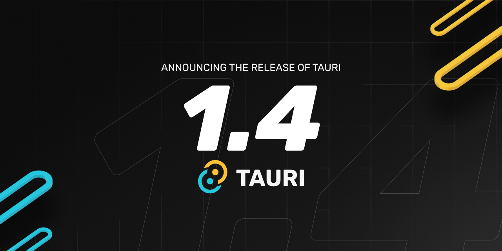

The Tauri team is excited to announce the 1.4 release. This version includes several new features and important bug fixes such as CLI completions, unit testing capabilities and Windows installer improvements.

## Upgrading

Make sure to update both NPM and Cargo dependencies to the 1.4.0 release. You can update the NPM dependencies with:

```shell
npm install @tauri-apps/cli@latest @tauri-apps/api@latest
```

```shell
yarn upgrade @tauri-apps/cli @tauri-apps/api --latest
```

```shell
yarn up @tauri-apps/cli @tauri-apps/api
```

```shell
pnpm update @tauri-apps/cli @tauri-apps/api --latest
```

To update the Cargo dependencies, run the following in the `src-tauri` folder:

```shell
cargo update
```

## What's in 1.4.0

### CLI completions

The Tauri CLI now can generate shell completions for Bash, Zsh, PowerShell and Fish. See the [documentation](/v1/api/cli#completions) for more information.

### Disabling window controls

The window's maximize, minimize and close buttons now can be disabled via configuration or API calls. Check out [`set_maximizable`](https://docs.rs/tauri/1/tauri/window/struct.Window.html#method.set_maximizable), [`set_minimizable`](https://docs.rs/tauri/1/tauri/window/struct.Window.html#method.set_minimizable) and [`set_closable`](https://docs.rs/tauri/1/tauri/window/struct.Window.html#method.set_closable) for the Rust APIs and [`setMaximizable`](/v1/api/js/window#setmaximizable), [`setMinimizable`](/v1/api/js/window#setminimizable) and [`setClosable`](/v1/api/js/window#setclosable) for the JavaScript APIs.

### NSIS improvements

The 1.4.0 release includes several NSIS bundle enhancements:

- Custom language files
- Custom installer template (.nsi file)
- Support for the dutch, japanese, korean, persian, swedish and turkish languages
- If your application is installed via WiX, the installer will prompt the user to uninstall it
- Improved support to updater install modes

See the [installer customization guide](/v1/guides/building/windows#customizing-the-nsis-installer-template) and [installer internationalization](/v1/guides/building/windows#internationalization) for more information.

### MSRV change

Tauri 1.4 still has a minimum supported Rust version of 1.60, but due to some dependency incompatibility issues we are no longer pinning the patch version of the `time`, `ignore`, and `winnow` crates. If you are still using Rust 1.60, you will need to pin these versions manually with [cargo update](https://github.com/tauri-apps/tauri/blob/076e1a81a50468e3dfb34ae9ca7e77c5e1758daa/.github/workflows/test-core.yml#L88).

### Unit tests

The `tauri` crate now exposes the `test` module under the `test` Cargo feature. This module is still unstable but allows you to unit test your application by creating a `tauri::App` instance that can execute without spawning windows. See the [documentation](https://docs.rs/tauri/1/tauri/test/index.html) for more information and examples.

### Other changes

Starting on v1.4.0, our changelog format has been improved. Check out the entire list of changes:

- [tauri](https://github.com/tauri-apps/tauri/releases/tag/tauri-v1.4.0)
- [tauri-cli](https://github.com/tauri-apps/tauri/releases/tag/tauri-cli-v1.4.0)
- [tauri-bundler](https://github.com/tauri-apps/tauri/releases/tag/tauri-bundler-v1.3.0)

## Audit

The _internal_[^1] audit was performed by Tillmann [@tillmann-crabnebula](https://github.com/tillmann-crabnebula)
and Chip [@chip-crabnebula](https://github.com/chip-crabnebula),
who are also involved in security topics at the project under their private handles ([@tweidinger](https://github.com/tweidinger) and [@chippers](https://github.com/chippers)).

It was performed during paid time at [CrabNebula Ltd.](https://crabnebula.dev) and we are grateful to be able
to spend parts of our work time contributing to the open source project and making it a more secure environment :heart:.

For this release we manually audited a selection of [PRs](https://github.com/tauri-apps/tauri/issues?q=label%3A%22security%3A%20reviewed%22%20is%3Aclosed)
instead of all PRs coming into the release.
The new approach means the reviewers and developers need to decide on their own if a PR is introducing any security relevant change.
A review can be triggered by anyone involved in the change, by adding a label to the PR.

For the first time we also audited after the official release due to time constraints.
This resulted in a [security patch](https://github.com/tauri-apps/tauri/security/advisories/GHSA-wmff-grcw-jcfm) release, fixing the only impactful issue (CVE-2023-34460) discovered during auditing.
In general this release was more focused on fixing and improving the NSIS features and introduced less new features and security relevant changes.

[^1]: It is internal in the sense that we are also involved in the project itself but performed with the help of an external entity. Calling it external security audit would create false impressions.
